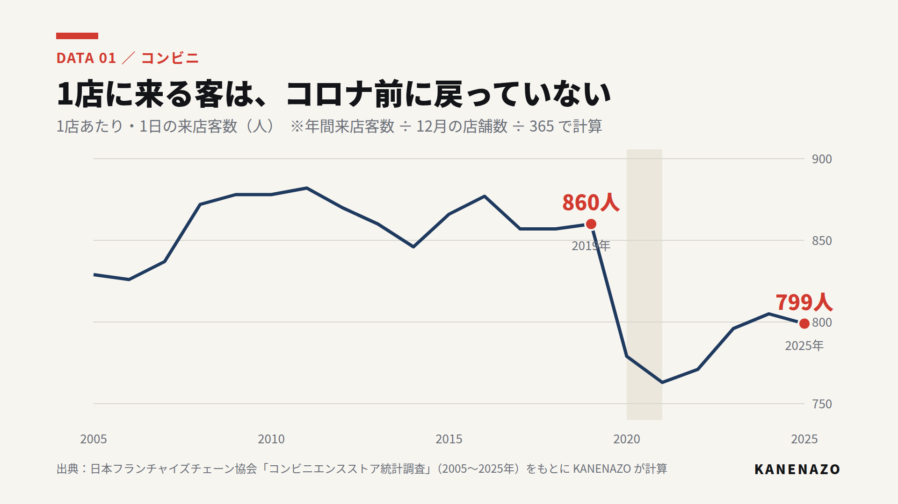
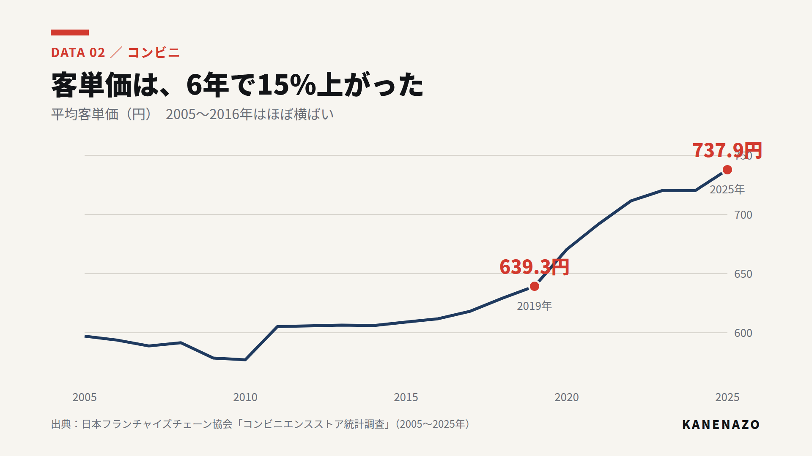
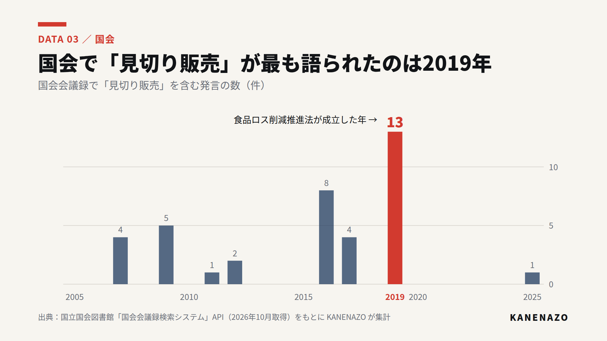

# 데이터 데스크 시범: 편의점 (#010)

AI가 1차 자료를 통째로 읽고 **우리만의 계산·그래프**를 만드는 방식의 첫 시범. 원자료와 표는 `data_desk/case010/`, 그래프 코드는 `video/src/news/`.

## 쓴 1차 자료

| 자료 | 범위 | 접근 |
|---|---|---|
| 日本フランチャイズチェーン協会「コンビニエンスストア統計調査」시계열 PDF 2개 | 2005~2025년(21년), 연간 매출·점포 수·손님 수·객단가 | ○ (`raw/`에 원본 PDF) |
| 国立国会図書館「国会会議録検索システム」API | 「コンビニ会計」「見切り販売」「食品ロス コンビニ」 전체 발언 | ○ (발언 목록·URL 저장) |
| 公正取引委員会 | — | ✕ 이 환경에서 차단(403) |

## 찾은 것 (영상에 바로 쓸 수 있는 "여기서만 보는 숫자")

| # | 발견 | 숫자 | 표시 |
|---|---|---|---|
| 01 | **1점포에 하루 오는 손님은 코로나 전으로 돌아오지 않았다** | 860명(2019) → 799명(2025), 약 60명 감소 | 계산(연간 손님 수 ÷ 12월 점포 수 ÷ 365) |
| 02 | **매출 사상 최고는 손님이 아니라 객단가 덕분** | 객단가 639.3엔(2019) → 737.9엔(2025), +15%. 2005~2016년은 590~610엔대로 거의 그대로 | 협회 발표 숫자 |
| 03 | 점포 수는 2017년 이후 9년째 5만5천~5만6천 곳에서 멈춤(포화) | 55,322(2017) → 56,054(2025) | 협회 발표 숫자 |
| 04 | **국회에서 「見切り販売」가 가장 많이 언급된 해는 2019년**(13건, 식품 로스 삭감 추진법 성립 해) | 2016년 8건, 2019년 13건, 2025년 1건 | 집계(편의점 외 맥락의 발언도 포함) |
| 05 | 「コンビニ会計」 발언은 2014년이 가장 많음(6건), 2003년 5건 | 총 21건 | 집계 |

## #010 대본과의 관계

- 지금 E23은 「来店する客の数は、0.5%減った」(1년 변화). **01·02로 바꾸면** "점포당 손님은 6년 동안 60명 줄었고, 매출은 객단가로 지탱한다"는 구조적 설명이 된다 → "버리는 비용이 왜 더 아픈가"와 연결.
- E24~E27 「なぜ今、動き始めたのか？」에 **04**를 넣으면 2019년(포인트 환원 시작 해)과 국회 논의의 정점이 겹친다는 근거가 생긴다. 단, **인과로 말하지 않는다**(같은 해라는 사실만).

## 주의

- 01은 12월 점포 수로 나눈 근사 계산이다. 화면에 「計算」 표시.
- 04·05의 국회 발언에는 편의점이 아닌 소매 일반의 「見切り販売」도 섞여 있다. 영상에서는 「国会で『見切り販売』という言葉が出た回数」로 정확히 말한다.
- 2020~2021년은 코로나 영향(그래프에 회색 띠).

## 그래프 (뉴스 그래픽 패키지 시안)

- 원칙: 제목 = 결론, 부제 = 단위·계산 방법, 왼쪽 아래 = 출처, 강조색은 빨강 하나.
